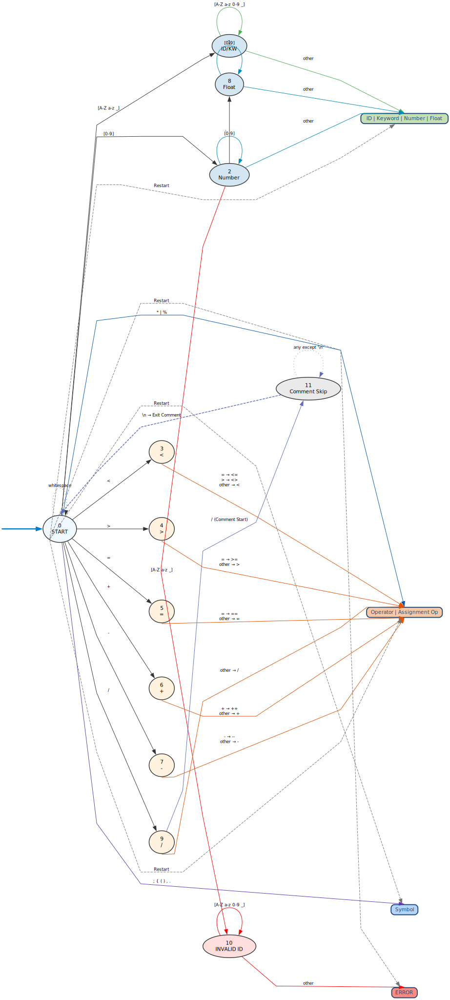

# COMPILER-LAB

[](https://github.com/5heron/COMPILER-LAB/archive/refs/heads/main.zip)

B.Tech CSE Compiler Design Lab  
**University:** APJ Abdul Kalam Technological University

---

## 📌 Content

### **Lex Programs**
**Lexical Analysis Programs:**
- [Armstrong](Lex/armstrong.l)
- [Calculator](Lex/calculator.l)
- [EvenOdd](Lex/evenOdd.l)
- [LinesSpacesTabs](Lex/nLinesSpacesTabs.l)
- [Palindrome](Lex/palindrome.l)
- [Positives Count](Lex/positivesCnt.l)
- [Prime](Lex/prime.l)
- [Vowel Consonant](Lex/vowelConsonant.l)
- [Lexical Analyzer](Lex/lex.l)

**Input Files:**
- [input.txt](Lex/input.txt)
- [inputNumbers.txt](Lex/inputNumbers.txt)

---

### **Yacc / Bison Programs**

#### Expression Evaluation
- **Lex file:** [Expression Evaluation](Yacc/ExpressionEval.l)  
- **Yacc file:** [Expression Evaluation](Yacc/ExpressionEval.y)  

#### Expression Validation
- **Lex file:** [Expression Validation](Yacc/ValidExpression.l)  
- **Yacc file:** [Expression Validation](Yacc/ValidExpression.y)  

#### Identifier / Declaration Validation
- **Lex file:** [Identifier Validation](Yacc/ValidDeclaration.l)  
- **Yacc file:** [Identifier Validation](Yacc/ValidDeclaration.y)

#### C Program Structs Parser
- **Lex file:** [C Program Validation](Yacc/Cprogram.l)  
- **Yacc file:** [C Program Validation](Yacc/Cprogram.y)  

**Input Files:**
- [input.txt](Yacc/input.txt)
---

### **Other Programs**
- [First And Follow](firstNfollow.c) – First and Follow set computation  
- [Intermediate Code Generation](IntermediateCodeGen.c) – Intermediate code generation
- [Constant Folding and Propogation](ConstantFolding.c) - Constant folding and propogation
- [Common Subexpression Elimination](CommonSubElimination.c) - Common subexpression elimination and dead code elimination
- [Assembly Code Generation](GenAssembly.c) - Assembly code generation
- [Shift Reduce Parser](shiftReduce.c) – Shift-Reduce parser example  
- [Recursive Descent Parser](RecursiveDescent.c) – Recursive Descent parser example  
- [Lexical Analyzer](lex.c) – Generic lex program

**Input and Output Files:**
- [Input Expressions](inputExpressions.txt)
- [Intermediate code](icode.txt)
- [Optimized code 1](opt1code.txt)
- [Optimized code 2](opt2code.txt)

#### DFA for Lexical Analyzer


---

## 🔧 Requirements

1. **Flex & Bison**  
   - Linux: `sudo apt install flex bison`  
   - Windows: [Cygwin](https://www.cygwin.com/) or [WSL](https://learn.microsoft.com/en-us/windows/wsl/)

2. **GCC Compiler**  
   - Linux: usually pre-installed  
   - Windows: [TDM-GCC MinGW Compiler](https://sourceforge.net/projects/tdm-gcc/)

3. **Any Text Editor**  
   - [VS Code](https://code.visualstudio.com/)  
   - [Sublime Text](https://www.sublimetext.com/)  
   - [Atom](https://atom.io/)

---

## 🚀 Getting Started

Clone the repository:

```sh
git clone https://github.com/5heron/COMPILER-LAB.git
cd COMPILER-LAB
````

### **Running Lex Programs**

1. Compile using Flex:

```sh
flex filename.l
gcc lex.yy.c -o program -lfl
```

2. Run:

```sh
./program
```

### **Running Yacc/Bison Programs**

1. Generate parser and lexer:

```sh
yacc -d ExpressionEval.y
flex ExpressionEval.l
```

2. Compile both:

```sh
gcc y.tab.c lex.yy.c -o expr_eval -lfl
```

3. Run:

```sh
./expr_eval
```

---

## ⭐ Spread the Word!

If you found this helpful, give it a ⭐ and share it with your peers!
